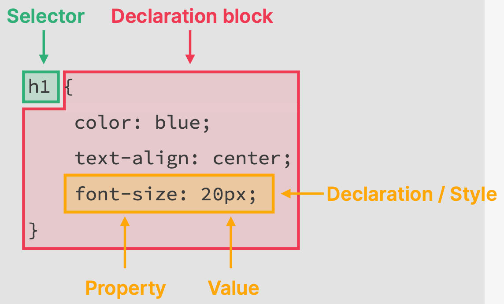
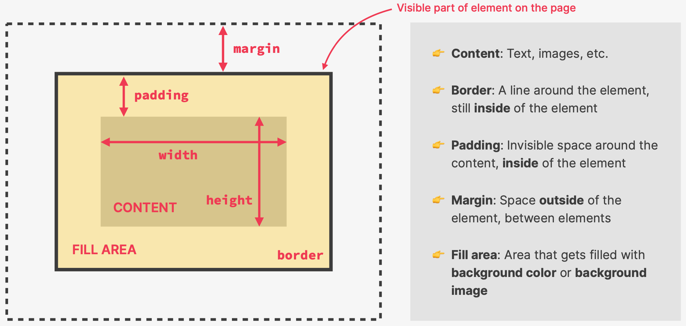

## theory-lectures-v2-BEST.pdf

https://drive.google.com/drive/folders/1ag9XK4aQS0Aux9-aVkxKTCsieP8_Gs0c?usp=sharing

## Concepts

- Static vs Dynamic Websites

## HTML

HyperText Markup Language: to structure and describe the content of a webpage (not a programming language), consists of elements that describe the type of content (paragraphs, links, headings, images, videos, etc.)

### Concepts

- Elements: (e.g. `<button>`, `<article>`, `
`, etc.)
- Attributes: (e.g. `src`, `alt`, `href`, etc.) part on an Element
- Entities: (e.g. `&copy;`) part of the content
- Semantic HTML: (e.g. `<strong>` vs `<b>`, `<em>` vs `<i>`, `<nav>` vs `
`)

### Good practices

- only one `<h1>` per page
- `<strong>` instead of `<b>` (html 5)
- `<em>` instead of `<i>` (html 5)
- Always add `alt` to all images, its used by search engines to know what the image is about BUT also for screen readers used by blind people. If the image is broken the alt text is shown.
- The first page should be called `index.html`

## CSS

Cascading Style Sheets: to describe the visual style and presentations of the content written in HTML

### Concepts

- CSS Rule

  - Selector: e.g. `h1`
  - Declaration Block: multiple Declarations contained by curly brackets

    - Declaration or Style: e.g. `front-size: 20px;`
      - Property: e.g. `font-size`
      - Value: e.g. `20px`

    

- Inline CSS: using the `style` attribute in the html code (Separation of Concern)
- Internal CSS: `style` element instead of an attribute
- External CSS: independent `*.css` file
- RGB/RGBA Notation: `rgb(0,255,255)`, `rgba(0,255,255,0.3)`. The A in RGBA in Alpha or Transparency
- Hexadecimal Notation: #00ffff, 0 to ff instead 0 to 255. Shorthand #0ff
- Element Selector: the element name
- ID Selector: `#` as prefix of the ID name
- Class Selector: `.` as prefix of the class name
- Pseudo Class: automatic/inferred class, selector `:`, e.g. `element:pseudo-class`
- Pseudo Element: selector `::`, e.g. `h1::first-letter`
- Adjacent Sibling Selector: `+`, e.g. `h3 + p::first-line` which means that the declaration block will apply to the first line of the paragraphs that come right after a heading 3.
- Specificity (Conflicting Selector Declarations or Selector Declaration Priority): If multiple ID/Class/Pseudo-Class/Element selectors with conflicting Declarations, the last one applies.
  - Declarations marked `!important` have the highest priority, its used as a last resort to resolve conflicts (bad practice)
  - Then Inline Style (bad practice)
  - then ID. If multiple selectors with conflicting Declarations, the last one applies
  - then class or pseudo-class. If multiple selectors with conflicting Declarations, the last one applies
  - then element. If multiple selectors with conflicting Declarations, the last one applies
  - lastly the universal selector
- Universal Selector (\*):
- Multiple Classes: `class="class-1 class-2"`
- Important Keyword: `color: #0f0 !important;`
- Inheritance: child Elements inherit from Parent elements declarations and these have the lowest priority. Not all declarations get inherit, mostly text related ones.
- CSS Box Model:
  - Final element width = left border + left padding + width + right padding + right border
  - Final element height = top border + top padding + height + bottom padding + bottom border

  

- Collapsing Margins: when two margins collide, only the biggest one gets applied.
- Block-level Elements: Occupy 100% of the parent width, stacked vertically, the box model applies as described above.
- Inline Elements: Occupies only space needed for its content, causes no line-breaks, box model applies differently (heights and widths do not apply, padding and margin are applied only horizontally). `display: inline` to transform a block-level element into an inline element.
- Inline-block Boxes: mix of block and inline elements, does not occupy 100% of parent, occupies only space needed for content, causes no line breaks (not stacked vertically), box model applies (i.e. heights, widths, padding and margins). Images behave like this.
- Normal Flow: default position, Element "in flow", Elements laid out according to the order in the html code. `position: relative`
- Absolute Positioning: Removed from normal flow, Element "out of flow", does not affect surrounding elements but might overlap them, use top, bottom, lef or right to offset the element from its first relatively positioned parent element. `position: absolute`

### Good practices

- Do not use Inline CSS
- `id` or `class` instead of descendant selector with the html element
- User `class` instead of `id` even if there is only one use of it
- Hexadecimal for color and RGBA when transparency is needed
- Define element `a` pseudo-classes `visited`, `hover`, and `active` in that same order

## Notes

- The browsers Developer Tool allows you to see, modify and play with the Elements, Styles, pseudo-classes, etc.

## Questions

- Jonas said that HTML, CSS amd JS are the languages browsers accept. Are there other languages?

## Reference

- [Flexbox & CSS Grid](./html-css-course/final/04-CSS-Layouts)
  - [CSS Grid](./html-css-course/final/04-CSS-Layouts/css-grid.html)
  - [Flexbox](./html-css-course/final/04-CSS-Layouts/flexbox.html)
- [Design](./html-css-course/final/05-Design)
- [Components](./html-css-course/final/06-Components)
  - [accordion](./html-css-course/final/06-Components/01-accordion.html)
  - [carousel](./html-css-course/final/06-Components/02-carousel.html)
  - [table](./html-css-course/final/06-Components/03-table.html)
  - [pagination](./html-css-course/final/06-Components/04-pagination.html)
  - [hero](./html-css-course/final/06-Components/05-hero.html)
  - [app-layout](./html-css-course/final/06-Components/06-app-layout.html)
- [Omnifood Basic](./html-css-course/final/07-Omnifood-Desktop)
- [Omnifood Responsive](./html-css-course/final/08-Omnifood-Responsive/): page responsive to Small Laptops, Tablets (Landscape &  Small) and Phones.
- [Omnifood Optimizations](./html-css-course/final/09-Omnifood-Optimizations/): Mobile Navigation, Smooth Scrolling, Sticky Navigation Bar, Performance with Lighthouse, Favicon and Meta Description, Image Optimizations, Deployment to Netlify